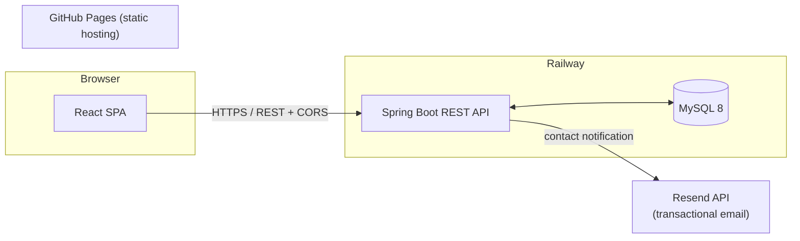
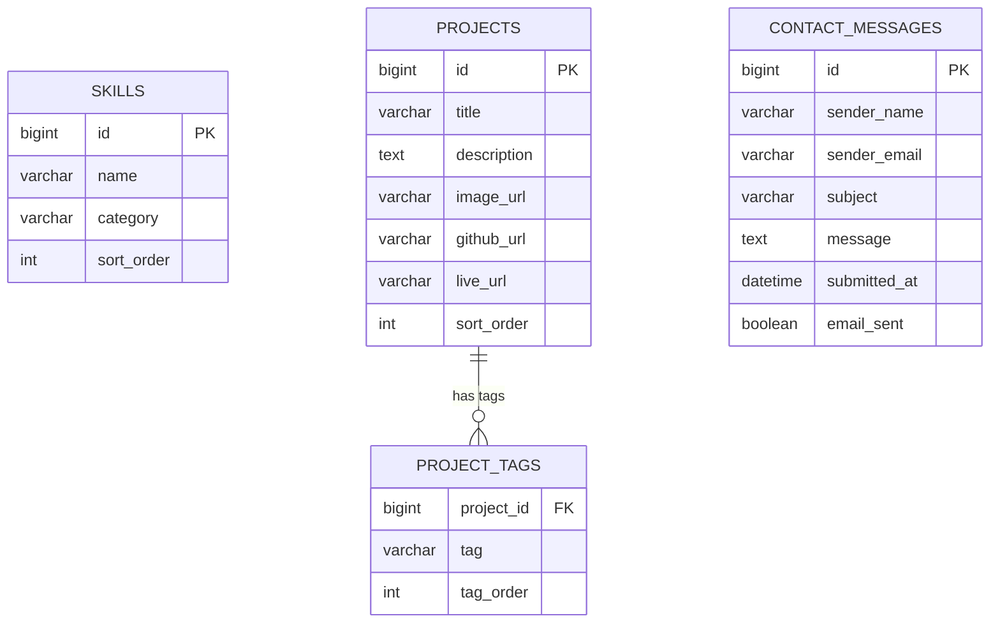

# Gopichand Mogaparthi — Portfolio

[](https://gopichandmogaparthi.github.io)
[](https://gopichandmogaparthigithubio-production.up.railway.app/api/projects)
[]()
[](https://gopichandmogaparthi.github.io)
[](https://railway.app)

A full-stack personal portfolio — React frontend, Spring Boot REST API backend, MySQL persistence, and a resilient contact-form pipeline. Built and deployed as two independently-hosted services communicating over a public REST API.

**Live:** [gopichandmogaparthi.github.io](https://gopichandmogaparthi.github.io)
**API:** [gopichandmogaparthigithubio-production.up.railway.app/api](https://gopichandmogaparthigithubio-production.up.railway.app/api/projects)

---

## Table of Contents

- [Architecture](#architecture)
- [Tech Stack](#tech-stack)
- [Project Structure](#project-structure)
- [Database Schema](#database-schema)
- [API Reference](#api-reference)
- [Local Development](#local-development)
- [Environment Variables](#environment-variables)
- [Deployment](#deployment)
- [Design Notes](#design-notes)

---

## Architecture



Two independently deployed services:

- **Frontend** — a static React SPA built with Create React App, hosted on **GitHub Pages**. It fetches skills/projects from the API on load and gracefully falls back to static content if the API is unreachable.
- **Backend** — a Spring Boot REST API, hosted on **Railway**, backed by a Railway-managed **MySQL** instance. Handles skills, projects, and the contact form.

The two are decoupled by design: the frontend never breaks if the backend is down (fallback data), and the backend never loses a contact submission if outbound email fails (persist-then-notify).

---

## Tech Stack

| Layer | Technology |
|---|---|
| Frontend | React 18, Tailwind CSS 3, Create React App (react-scripts 5) |
| Backend | Java 17, Spring Boot 3.2 (Web, Data JPA, Validation), Maven |
| Database | MySQL 8 (Hibernate `ddl-auto=update`) |
| Email | [Resend](https://resend.com) REST API via Spring's `RestClient` (no SDK dependency) |
| Frontend hosting | GitHub Pages (`gh-pages` branch, deployed via the `gh-pages` npm package) |
| Backend hosting | [Railway](https://railway.app) (Railpack builder, auto-deploys on push to `main`) |
| CI trigger | Railway GitHub integration — push to `main` → build → deploy |

---

## Project Structure

```
portfolio-fullstack/
├── portfolio/                     # React frontend
│   ├── public/
│   │   ├── index.html
│   │   ├── favicon.svg            # "GM" monogram
│   │   └── images/profile.jpeg
│   └── src/
│       ├── components/            # Navbar, Hero, About, Skills, Projects, Contact, Footer
│       ├── hooks/useFetch.js       # generic fetch hook w/ loading + error state
│       └── services/api.js         # REACT_APP_API_URL-driven API client
│
├── portfolio-backend/             # Spring Boot backend
│   └── src/main/java/com/gopichand/portfolio/
│       ├── controller/            # thin HTTP layer — binds requests, delegates to services
│       ├── service/               # business logic (SkillService, ProjectService,
│       │                          #   EmailService, ContactService)
│       ├── repository/            # Spring Data JPA interfaces
│       ├── model/                 # JPA entities (Skill, Project, ContactMessage)
│       ├── dto/Dtos.java          # all request/response DTOs — entities never
│       │                          #   cross the API boundary directly
│       └── config/
│           ├── CorsConfig.java    # single source of truth for allowed origins
│           └── DataLoader.java    # idempotent startup seed (skills + real projects)
│
└── README.md
```

**Layered request flow (backend):** `Controller → Service → Repository → MySQL`. Controllers only bind/validate HTTP input and return DTOs; all business logic lives in the service layer.

---

## Database Schema



- **`skills`** — flat table, grouped by `category` at the API layer (`GET /api/skills/categories`) rather than via a separate categories table.
- **`projects`** / **`project_tags`** — one-to-many, tag order preserved via `@OrderColumn`.
- **`contact_messages`** — every submission is persisted **before** an email send is attempted. `email_sent` records whether the Resend notification succeeded, but the message itself is never lost on email failure.

Schema is managed by Hibernate (`spring.jpa.hibernate.ddl-auto=update`) — no separate migration tool; tables are created/updated automatically from the `@Entity` classes on boot.

---

## API Reference

| Method | Endpoint | Description | Body |
|---|---|---|---|
| `GET` | `/api/skills` | Flat list of skills, ordered by category/sortOrder/name | — |
| `GET` | `/api/skills/categories` | Skills grouped by category: `[{ name, skills: [string] }]` | — |
| `GET` | `/api/projects` | All projects, ordered by `sortOrder` | — |
| `GET` | `/api/projects/{id}` | Single project, `404` if not found | — |
| `POST` | `/api/projects` | Create a project → `201 Created` | `ProjectRequest` |
| `PUT` | `/api/projects/{id}` | Update a project | `ProjectRequest` |
| `DELETE` | `/api/projects/{id}` | Delete a project → `204 No Content` | — |
| `POST` | `/api/contact` | Submit the contact form — persists first, then attempts an email notification | `ContactRequest` |

`POST`/`PUT`/`DELETE` on `/api/projects` are unauthenticated — intended for admin use via Postman/curl, not exposed in the UI.

**Example — `POST /api/contact`**
```json
{
  "name": "Jane Smith",
  "email": "jane@example.com",
  "subject": "Job Opportunity",
  "message": "Hi Gopichand, I'd like to discuss an opportunity..."
}
```
```json
{ "status": "success", "message": "Thanks for reaching out — I'll get back to you soon." }
```

---

## Local Development

### Prerequisites
- Node.js + npm
- Java 17, Maven
- MySQL 8 running locally

### Backend
```bash
cd portfolio-backend

# create the local database once
mysql -u root -p -e "CREATE DATABASE portfolio_db;"

# set local secrets as env vars (never commit these), then run
export SPRING_DATASOURCE_PASSWORD='your_local_mysql_password'
export RESEND_API_KEY='your_resend_api_key'
mvn spring-boot:run
# → http://localhost:8080/api
```
`DataLoader` seeds skills and real projects automatically on first boot (idempotent — safe to restart).

### Frontend
```bash
cd portfolio
npm install
npm start
# → http://localhost:3000, calls http://localhost:8080/api by default
```
If the backend isn't running, the UI falls back to static skills/projects data rather than showing an empty page.

---

## Environment Variables

### Backend (Railway → Service → Variables)

| Variable | Purpose | Example |
|---|---|---|
| `SPRING_DATASOURCE_URL` | JDBC URL | `jdbc:mysql://host:3306/db?useSSL=false&allowPublicKeyRetrieval=true&serverTimezone=UTC` |
| `SPRING_DATASOURCE_USERNAME` | DB user | `root` |
| `SPRING_DATASOURCE_PASSWORD` | DB password | — |
| `RESEND_API_KEY` | Resend API key | `re_xxxxxxxxxxxx` |
| `RESEND_FROM_EMAIL` | Verified sender | `onboarding@resend.dev` |
| `PORTFOLIO_CONTACT_TO_EMAIL` | Where contact-form notifications go | `gopichandmogaparthi@gmail.com` |
| `PORTFOLIO_ALLOWED_ORIGINS` | CORS allow-list | `https://gopichandmogaparthi.github.io,http://localhost:3000` |
| `PORT` | Injected automatically by Railway | — |

All of the above have safe local-dev fallbacks defined directly in `application.properties` (`${VAR:default}` syntax) — nothing is hardcoded, and the file is safe to commit as-is.

### Frontend

| Variable | Purpose | Set in |
|---|---|---|
| `REACT_APP_API_URL` | Backend base URL | `.env.production` (committed — it's a public URL, not a secret) |

---

## Deployment

### Frontend → GitHub Pages
```bash
cd portfolio
npm run deploy   # builds, then pushes /build to the gh-pages branch
```
Pages is configured to serve from the `gh-pages` branch of this repo.

### Backend → Railway
Connected directly to this repo's `main` branch, with **Root Directory** set to `portfolio-backend`. Every push to `main` triggers an automatic Railpack build (detects Java + Maven) and redeploy — no manual step required beyond `git push`.

Database is a Railway-managed MySQL plugin in the same project, referenced by the backend service via Railway's internal variable references (`${{MySQL.MYSQLHOST}}` etc.), so credentials are never duplicated across services.

---

## Design Notes

A few deliberate decisions worth calling out:

- **Contact form never loses a message.** `ContactService` persists to `contact_messages` first, then calls `EmailService`, which catches all failures internally and returns `boolean` rather than throwing. A Resend outage degrades to "email not sent" — never to "message lost."
- **No entities leak through the API.** Every controller returns a DTO from `dto/Dtos.java`, never a JPA entity directly.
- **CORS has one source of truth.** `CorsConfig` reads `portfolio.allowed-origins`; no controller carries its own `@CrossOrigin`, which would silently widen access beyond the configured allow-list.
- **`DataLoader` is idempotent.** Every seed check is `existsBy...` guarded, so redeploys and restarts never duplicate data.
